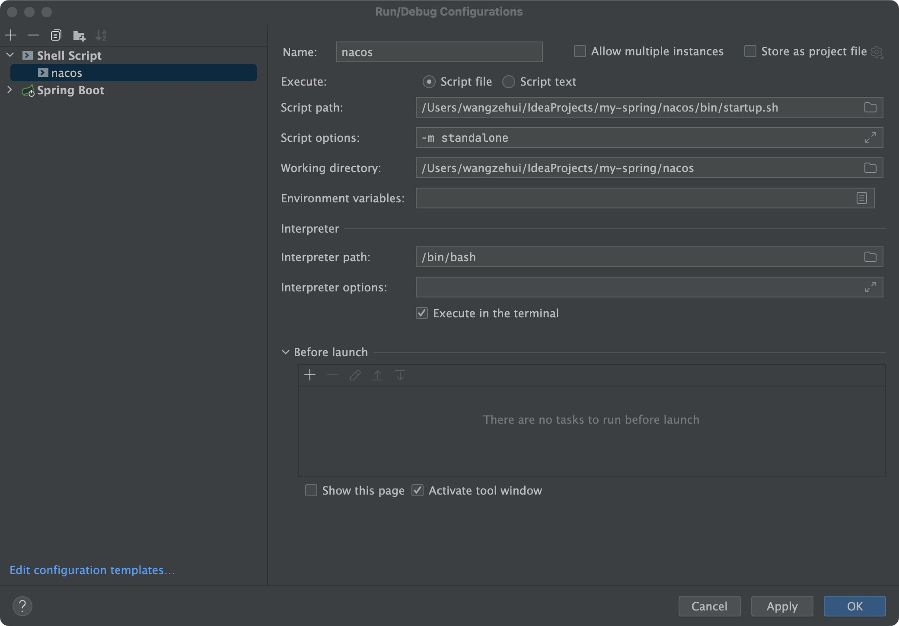
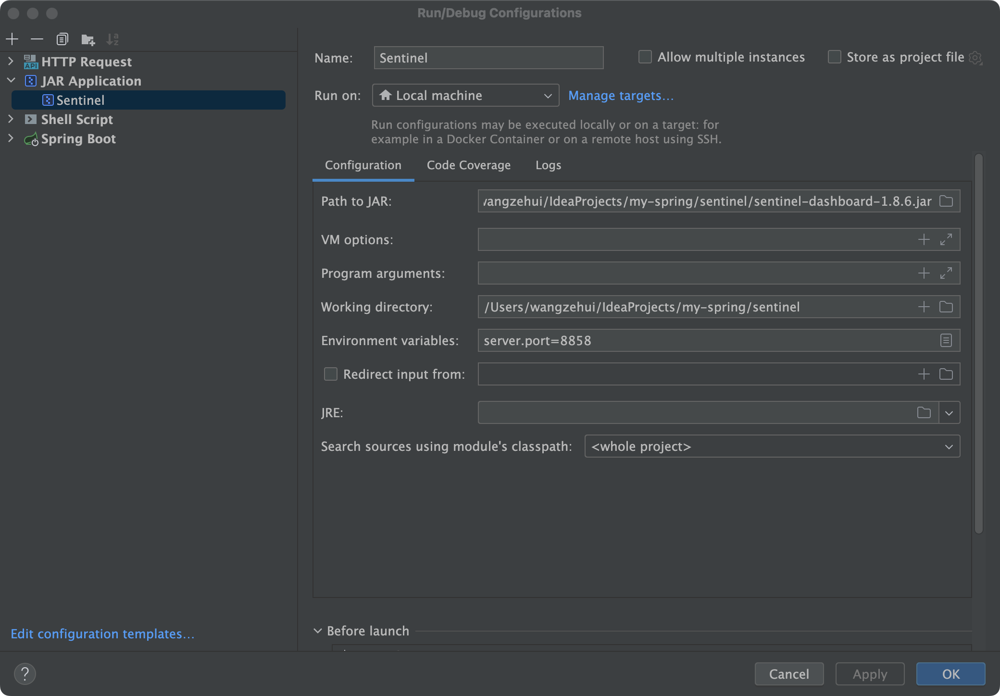
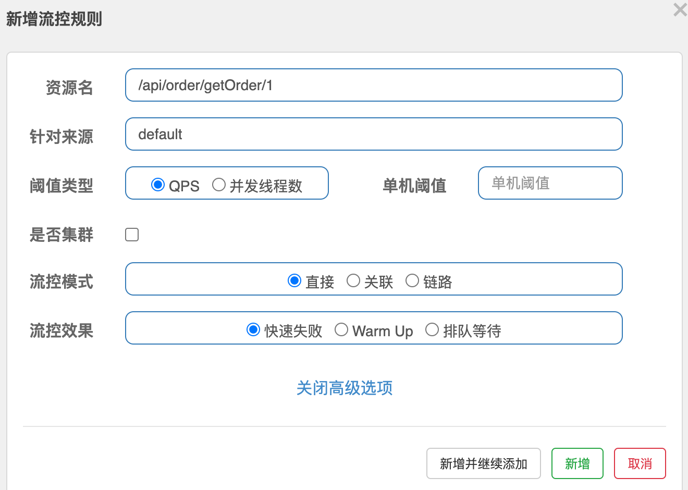

## spring-cloud学习

### 简介:
* 基于订单和支付业务简单的搭建一个spring cloud alibaba项目
* [Spring cloud和Alibaba版本对照](https://github.com/alibaba/spring-cloud-alibaba/wiki/%E7%89%88%E6%9C%AC%E8%AF%B4%E6%98%8E)
~~~xml
 <dependency>
    <groupId>org.springframework.cloud</groupId>
    <artifactId>spring-cloud-dependencies</artifactId>
    <version>2021.0.4</version>
    <type>pom</type>
    <scope>import</scope>
</dependency>

<dependency>
    <groupId>com.alibaba.cloud</groupId>
    <artifactId>spring-cloud-alibaba-dependencies</artifactId>
    <version>2021.0.4</version>
    <type>pom</type>
    <scope>import</scope>
</dependency>
~~~

### 1. Nacos（服务注册和配置中心）
[注册中心nacos服务端下载](https://github.com/alibaba/nacos)

项目中下载的2.2.2版本，导入项目中，然后添加一个shell script单节点配置

[访问地址](http://192.168.1.9:8848/nacos/index.html)

服务pom添加依赖
~~~xml
springboot
<dependency>
    <groupId>org.springframework.boot</groupId>
    <artifactId>spring-boot-starter-web</artifactId>
</dependency>

<dependency>
    <groupId>org.springframework.boot</groupId>
    <artifactId>spring-boot-starter-aop</artifactId>
</dependency>

<dependency>
    <groupId>org.springframework.boot</groupId>
    <artifactId>spring-boot-starter-test</artifactId>
</dependency>

springcloud
<!-- 注册nacos -->
<dependency>
    <groupId>com.alibaba.cloud</groupId>
    <artifactId>spring-cloud-starter-alibaba-nacos-discovery</artifactId>
</dependency>

<!-- 配置中心 -->
<dependency>
    <groupId>com.alibaba.cloud</groupId>
    <artifactId>spring-cloud-starter-alibaba-nacos-config</artifactId>
</dependency>

<dependency>
    <groupId>org.springframework.cloud</groupId>
    <artifactId>spring-cloud-starter-bootstrap</artifactId>
</dependency>
~~~

配置动态刷新注解@RefreshScope，@Value取到的值就是动态改变的

### 2.Gateway（网关，路由转发到服务）
~~~yml
spring:
  cloud:
    gateway:
      # 配置路由列表，每一项都包含了很多信息
      routes:
      - id: orderServer   # 路由名称
        uri: lb://orderServer  # 路由的地址，lb表示使用负载均衡到微服务，也可以使用http正常转发
        predicates: # 路由规则，断言什么请求会被路由
        - Path=/api/order/**  # 只要是访问的这个路径，一律都被路由到上面指定的服务
~~~

### 3. OpenFeign（远程调用）
~~~xml
<!-- 远程调用openfeign -->
<dependency>
    <groupId>org.springframework.cloud</groupId>
    <artifactId>spring-cloud-starter-openfeign</artifactId>
</dependency>
~~~

orderService需要用到payService的接口，pom引入payService依赖，orderService创建biz目录，添加注解@FeignClient("payServer")和配置文件服务名称一致
~~~java
@FeignClient("payServer")
public interface PayOrderClient {
    @RequestMapping("/api/getPayOrder/{id}")
    PayOrder getPayOrder(@PathVariable("id") Long id);
}
~~~

OrderApplication添加@EnableFeignClients注解开启远程调用

### 4.Loadbalancer（负载均衡，默认轮询）
~~~xml
<dependency>
    <groupId>org.springframework.cloud</groupId>
    <artifactId>spring-cloud-starter-loadbalancer</artifactId>
</dependency>
~~~

### 5.Sentinel（流量防卫兵，和Nacos一样需要单独下载部署）
[中文文档](https://sentinelguard.io/zh-cn/docs/introduction.html)

配置启动参数

[访问地址 账号密码：sentinel](http://localhost:8858/#/login)

然后pom引入依赖
~~~xml
<dependency>
    <groupId>com.alibaba.cloud</groupId>
    <artifactId>spring-cloud-starter-alibaba-sentinel</artifactId>
</dependency>
~~~

#### 5.1 流量控制    
  
流控模式：（1）针对当前接口  （2）当关联接口超阈值会导致当前接口限流（相当于就是别人出错，你背锅）   （3）更细粒度，精确具体方法  
流控效果：（1）快速失败，直接抛出异常FlowException  （2）预热Warm Up按照预热时长缓慢地进入 （3）排队等待

#### 5.2 异常处理
~~~yml
spring:
  cloud:
    sentinel:
      block-page: /api/order/blocked
~~~

~~~java
@RequestMapping("/blocked")
JSONObject blocked() {
    JSONObject object = new JSONObject();
    object.put("code", 403);
    object.put("success", false);
    object.put("massage", "您的请求频率过快，请稍后再试！");
    return object;
}
~~~

#### 5.3 热点参数限流
热点规则：针对一个接口中的参数进行策略限流

#### 5.4 服务熔断和降级

#### 5.5 [配置持久化](https://blog.csdn.net/qq_45557455/article/details/125694278?utm_medium=distribute.pc_relevant.none-task-blog-2~default~baidujs_utm_term~default-0-125694278-blog-123399569.235^v32^pc_relevant_default_base3&spm=1001.2101.3001.4242.1&utm_relevant_index=3)

### 6. Seata（分布式事务管理）
常规单体服务， 库存扣减->订单创建 在同一个事物中，可以用Transaction保证，但是微服务的话，按照业务模块进行拆分，库存和订单在不同的服务，事物如何保证
